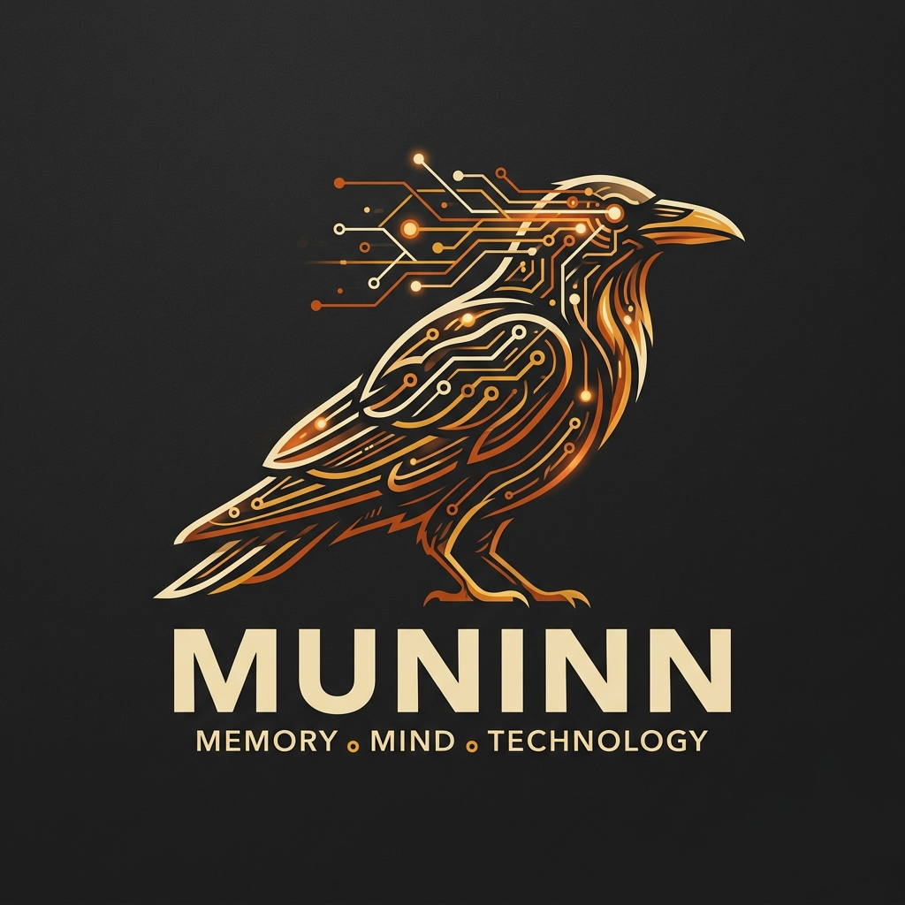
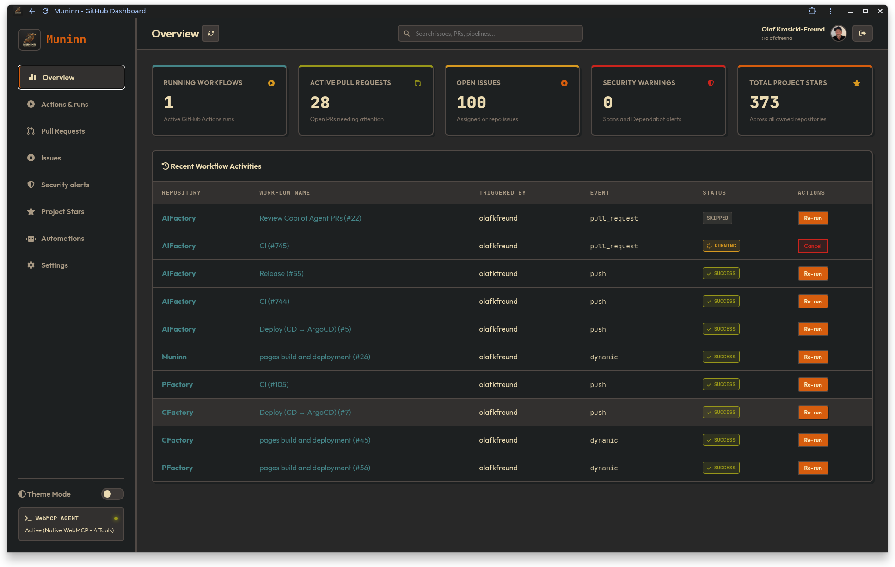
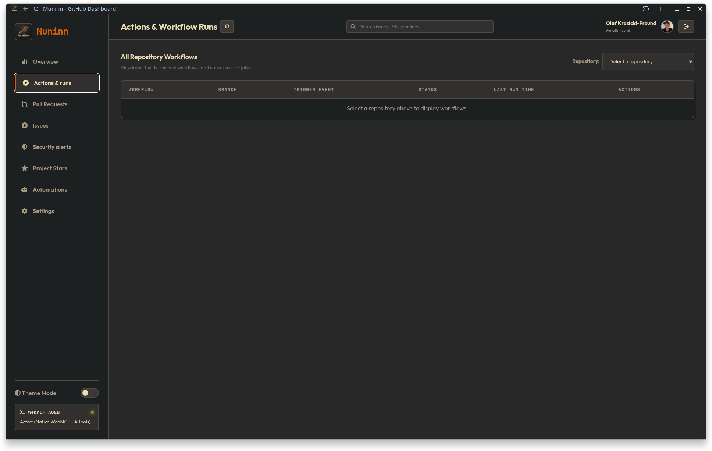
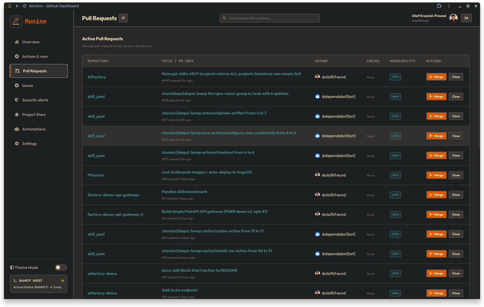
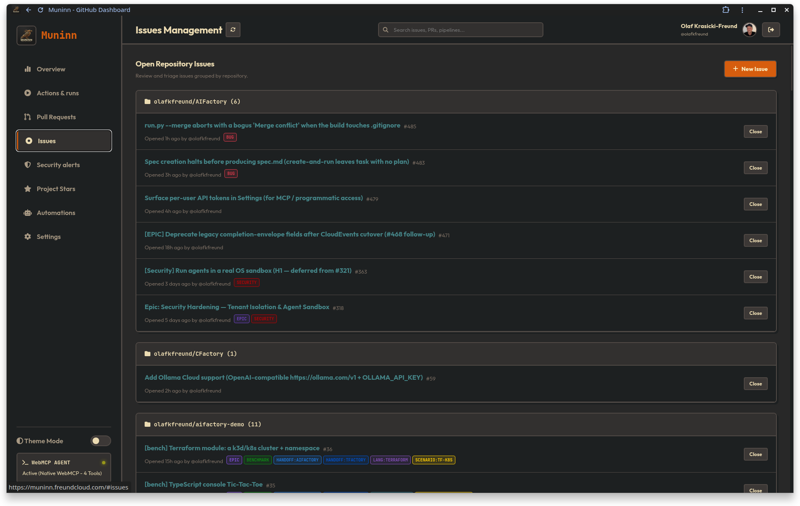
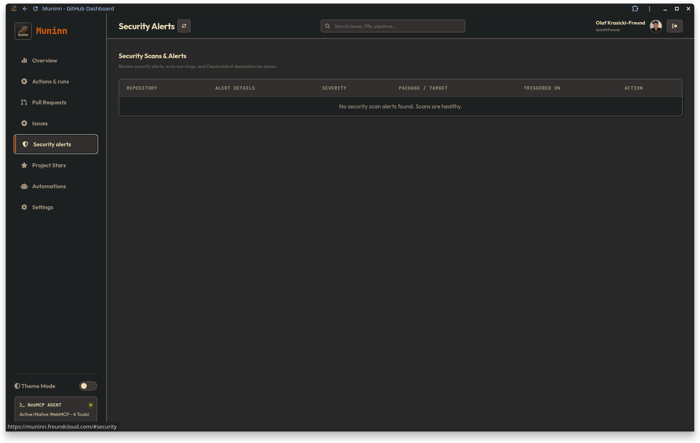
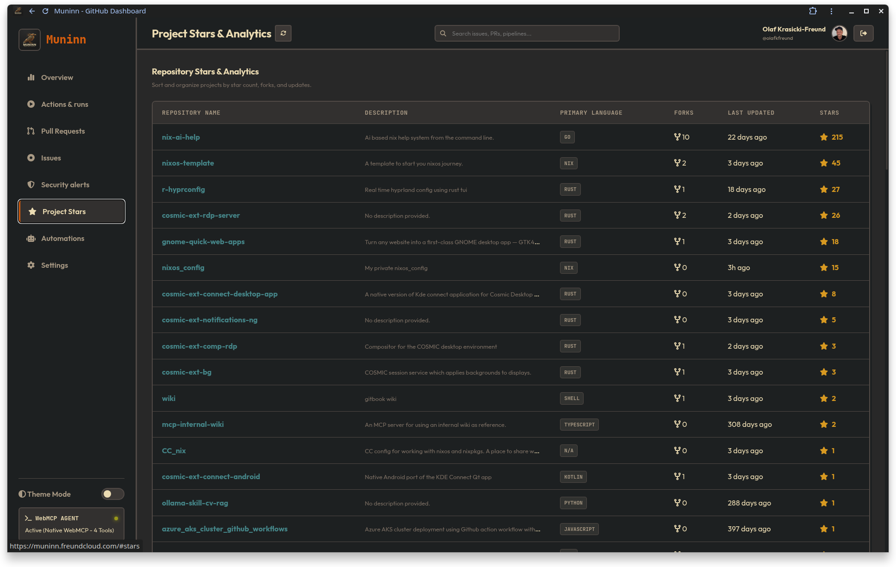
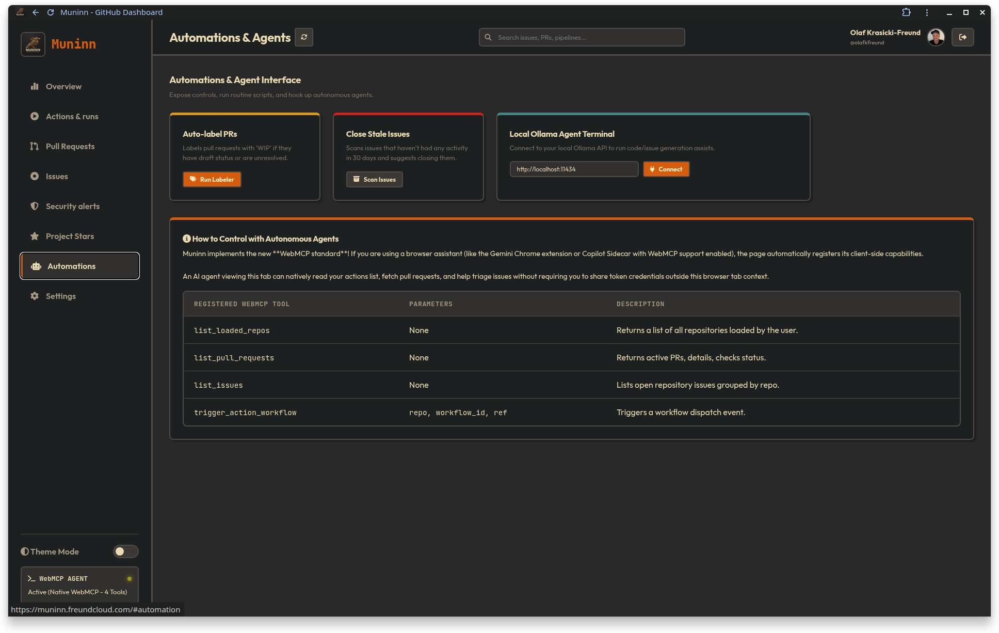
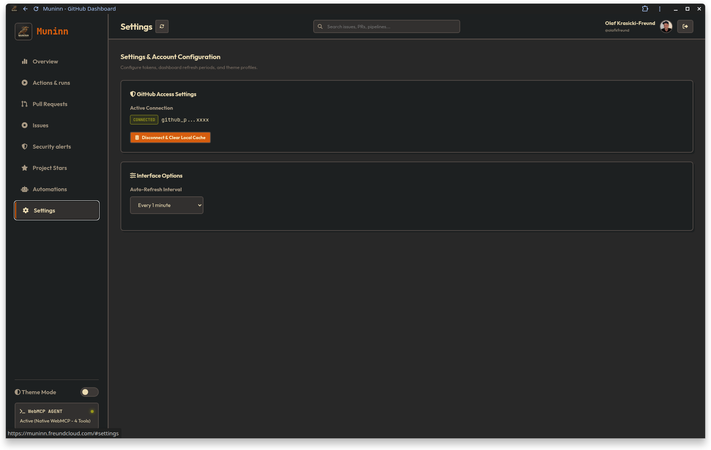

<p align="center">
  
</p>

# Muninn

Muninn is a modern, responsive GitHub management portal designed to connect to your GitHub account and help you monitor, manage, and automate your repositories, actions, issues, pull requests, security alerts, and stars. 

It features a retro-premium **Gruvbox** light and dark theme and implements the experimental browser-native **WebMCP (Web Model Context Protocol)** to allow local AI agents to control the interface.

Named after one of Odin's ravens, Muninn travels the GitHub API to bring you memory and insight.

---

## Showcase

<p align="center">
  
  
</p>
<p align="center">
  
  
</p>
<p align="center">
  
  
</p>
<p align="center">
  
  
</p>

---

## Features

*   **Gruvbox Aesthetics**: Dual theme (Light and Dark modes) featuring flat borders, retro shadows, and Outfit + JetBrains Mono typography.
*   **Universal Global Search**: Instantly find repositories, open pull requests, issues, and workflow runs from a unified, fast client-side query interface.
*   **Real-Time Notification Engine**: Combined desktop alerts (Web Notifications API) and customized Gruvbox in-app popup toasts for new issues, PR creation, PR merges, completed pipeline/workflow runs, and new security scan alerts. Built-in deduplication filters prevent startup spam.
*   **Workflow Runner**: Monitor runs (running, success, failed, stopped states) and trigger workflow dispatches or cancel active runs.
*   **Pull Requests Panel**: Review reviewers, check CI statuses, and merge or close PRs on the fly.
*   **Issue Tracker**: Group open issues by repository, label triage, and create new issues.
*   **Security Scanning Alerts**: Unified view of Dependabot and Code scanning warnings.
*   **Project Stars Analytics**: Sort, filter, and view star count metrics.
*   **Routine Automations**: Run daily scripts like PR auto-labeling (marking drafts as WIP) or stale issues cleanup.
*   **Local Ollama Chat Terminal**: Connect to a local Ollama instance (running `/api/generate`) directly from your dashboard to assist with draft generation and code analysis.
*   **WebMCP Integration**: Native browser tools registered dynamically to allow compatible AI extensions to query your repositories, pull requests, and issues directly from your open browser tab.
*   **Autonomous Developer Agent Daemon**: Background Python daemon (powered by the Google Antigravity SDK and real-time triggers) that watches code edits, runs syntax/validation tests, and periodically triages repository status.

---

## Development Environment Setup

Muninn is built as a static site using Jekyll and Vanilla JavaScript, with a reproducible development environment managed by `devenv`.

### Prerequisites
*   [Nix](https://nixos.org/download)
*   [devenv](https://devenv.sh/getting-started/)

### Local Development
To launch the development environment and start the local server:

1.  Clone the repository and enter the directory:
    ```bash
    cd Muninn
    ```
2.  Activate the devenv development shell:
    ```bash
    devenv shell
    ```
3.  Inside the shell, build the Jekyll project:
    ```bash
    serve
    ```
    This starts a local development server at `http://localhost:4000/Muninn/` with live reloading.

---

## Browser Native Agent Integration (WebMCP)

If you run Muninn in a Chromium-based browser supporting the WebMCP community draft (Chromium version `146.0.7672.0` or higher with `#enable-webmcp-testing` enabled), the portal registers client-side capabilities as tools.

The registered tools include:
*   `list_loaded_repos`
*   `list_pull_requests`
*   `list_issues`
*   `trigger_action_workflow`

This allows authorized agents or assistants in your browser tab to query dashboard state and perform actions on your behalf without transmitting your Personal Access Token outside the browser context.

---

## Documentation & Backstage Portal Integration

Detailed technical guides are available in the [docs/](docs/) directory:

*   **[Technical Overview](docs/index.md)**: Product goals, features, and target workflows.
*   **[Autonomous Developer Agent](docs/agent.md)**: Guide to setup, local execution, triggers, and Dockerization of the background agent daemon.
*   **[Architecture & Security Model](docs/architecture.md)**: Zero-backend design, folder layout, and local token storage details.
*   **[Local Development Setup](docs/development.md)**: Detailed devenv and Nix shell initialization guide.
*   **[Fallback MCP Bridge](docs/bridge.md)**: Configuration guide for connecting IDE/CLI agents to the browser tab via `mcp-bridge.js`.
*   **[Backstage Catalog Integration](docs/backstage.md)**: Details on annotations and TechDocs settings.

### Quick Start: Autonomous Developer Agent
The background Python agent daemon monitors your files for modifications in real time, runs syntax tests, and polls GitHub for open issues. To run it:

1.  Make sure your `.env` file contains `GEMINI_API_KEY` and your GitHub access token.
2.  Start the agent using your preferred method:
    *   **Via Devenv:** `devenv shell agent`
    *   **Via Docker:** `docker compose build && docker compose run --rm agent`

### Backstage Software Catalog
This repository is pre-configured with [catalog-info.yaml](catalog-info.yaml) for direct import into a **Backstage Developer Portal**. It registers the Muninn portal as a system tool and compiles the `docs/` markdown pages into **TechDocs** using the configuration in [mkdocs.yml](mkdocs.yml).

